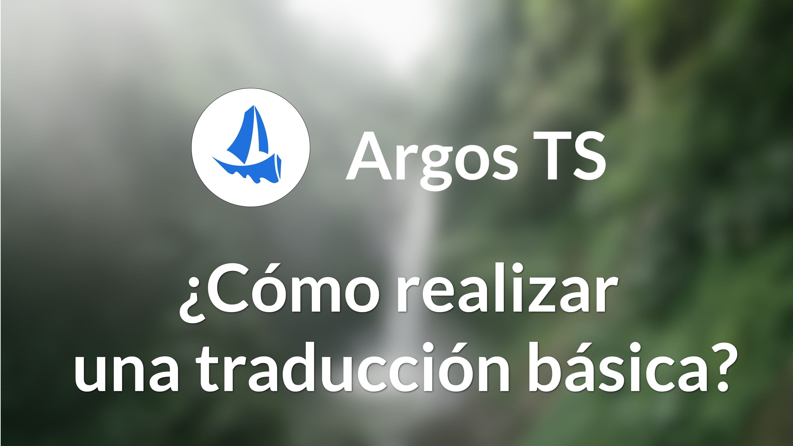
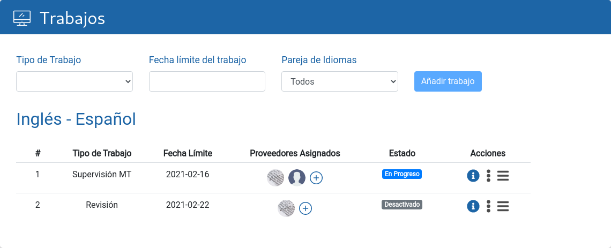
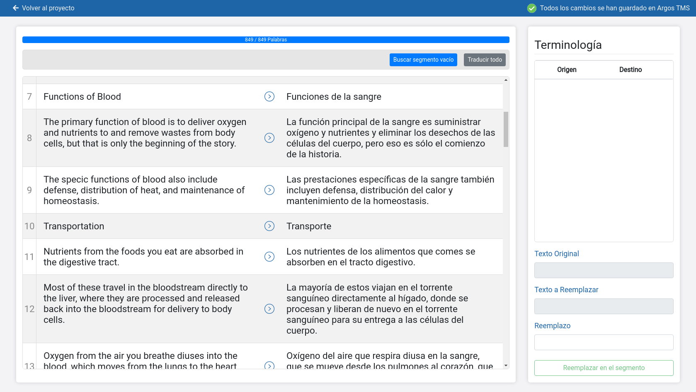

# Dar de alta un proyecto de traducción en Argos TS

La gestión de proyectos de traducción puede ser una tarea tediosa.
Acordar precios, cuadrar plazos y mandarse un sinfín de emails con cada
proveedor puede desembocar en la saturación de trabajo por parte de los
managers, llevando a que la empresa difícilmente pueda crecer.

El sistema de traducción Argos tiene una ventaja fundamental en este
aspecto: **todo el proceso de traducción estará automatizado** y
controlado desde la plataforma. De esta manera, no es necesario que
dirigirse individualmente a cada uno de tus proveedores de servicios
durante las distintas fases del proceso de traducción (asignación,
ejecución, entrega, revisión), sino que desde el propio sistema se
asignará cada tarea a los proveedores de servicios, quienes a su vez
trabajarán y entregarán su trabajo desde la propia plataforma. De esta
manera, es posible **ahorrar mucho tiempo** en comunicaciones que a
menudo son improductivas y pueden generar confusión y, por tanto, se
optimizará cada hora de trabajo contratada. Una vez pactadas las
condiciones del proyecto con tus proveedores de servicios, Argos lo
automatizará y la gestión quedará simplificada al máximo.

## Creación de un nuevo proyecto

Para comenzar a usar el sistema, debe crearse un nuevo [proyecto](referencia/proyecto.md#proyecto). Esto
corresponderá a un encargo que nos realice un cliente, como por ejemplo
la traducción de un documento.

Se muestran varios campos donde se puede introducir información general
del proyecto como puede ser la `fecha límite`, el `código de proyecto` que
nos ha proporcionado el cliente, temática o quién va a gestionar el
proyecto.

También debe indicarse cual es el `idioma origen` y el/los `idiomas destino`
del proyecto.

## Adjuntar los archivos a traducir

Debe adjuntarse en el apartado “[Archivos](referencia/proyecto.md#archivos)” el archivo que deseas
traducir. Se admiten archivos de Word, Excel, Powerpoint, Trados o
subtítulos, entre otros.

## Seleccionar el tipo de trabajo a realizar

Cada [trabajo](referencia/proyecto.md#trabajos) en Argos corresponde a una fase dentro del proyecto actual.

> Por ejemplo, supongamos que se recibe del cliente un documento PDF con
> texto e imágenes a traducir y revisar. En ese caso, una lista de
> trabajos coherente con el servicio que se va a prestar sería:
>
> 1. Adaptación de formato PDF a Word
> 2. Supervisión MT
> 3. Traducción de figuras
> 4. Revisión del documento

Para dar de alta un trabajo, debes seleccionar el tipo de trabajo que
deseas que Argos realice. Hay varios tipos de trabajo precargados:

- **Supervisión MT**: si necesitas que tu proveedor de servicios
    trabaje con una traducción realizada por Argos, esta opción genera
    dicha traducción y la pone a disposición del proveedor para que
    opere con ella desde la propia plataforma.

- **Alineamiento**: si existe una traducción previa del texto que
   deseas traducir con Argos, el sistema alineará dicha traducción con
    la suya propia, de manera que aprovecharás las sinergias entre ambas
    traducciones, eliminando inconsistencias e incorporando las partes
    previamente traducidas que te interesen a la traducción realizada
    por Argos, de manera que ahorrarás tiempo y recursos.

- **Multitraducción**: si necesitas que varios proveedores de
    servicios trabajen en un mismo documento siumltáneamente, Argos
    coordinará el trabajo de todos ellos desde la propia plataforma,
    eliminando así todos los problemas organizativos habituales en este
    tipo de proyectos compartidos.

- **Revisión**: si tu proyecto consiste únicamente en la revisión de
    un trabajo ya ejecutado, esta opción simplifica el proceso,
    automatizándolo en torno a esta fase final.

- **Traducción**: si necesitas trabajar con un sistema diferente al de
    Argos, mediante esta opción podrás asignar automáticamente tu texto
    al sistema en cuestión, simplificando así el proceso de reenvío.

    Es posible añadir tipos de trabajo propios como puede ser el caso de
    “Traducción de figuras”.

A la vista de lo anterior, para realizar una traducción básica con
Argos, el tipo de trabajo que debes seleccionar es `Supervisión MT` y
después, opcionalmente, `Revisión`. Una vez acabe la primera tarea
comenzará automáticamente la segunda.

## Asignar el trabajo a proveedores

Cada trabajo necesita ser asignado a un proveedor de servicios para que
pueda ser realizado.

Puedes asignar un trabajo a varios proveedores a la vez, de manera que
si el primero rechaza el trabajo, la oferta pasará automáticamente al
siguiente que la acepte, y tú simplemente recibirás una notificación si
todos los proveedores rechazan la oferta. Esto hace que realice el
trabajo sin que se produzcan vacíos ni demoras en la asignación del
trabajo.

Una vez aceptada la oferta, el proveedor de servicios podrá comenzar de
inmediato a trabajar desde la propia plataforma de Argos, disfrutando de
su sofisticado sistema de traducción automática.

