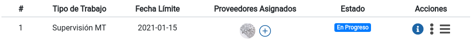
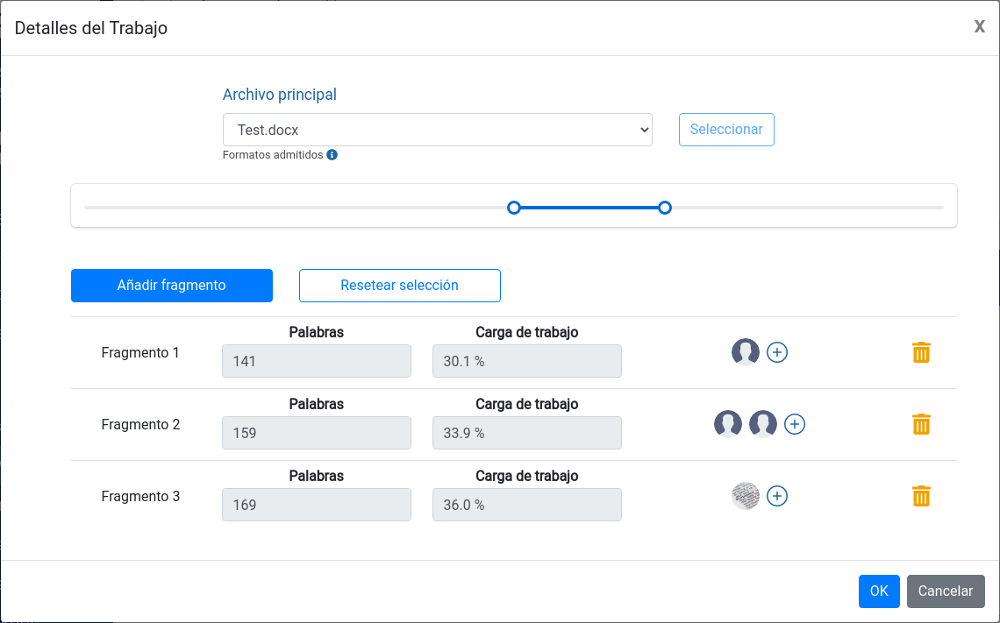

# Proyecto

## General

---

### Referencia Int.

`No editable`

Referencia generada automáticamente según la fecha actual y la numeración de proyectos anteriores.

### Referencia del Cliente

Número de referencia provisto por el cliente.

### Estado del Proyecto

El ciclo de vida de un proyecto comprende varias fases:

1. `Presupuesto`: Es una fase de borrador. Se puede almacenar información pero no se han activado los trabajos que comprende.
   Para pasar a la siguente fase debe pulsarse el botón `Guardar y ofertar`.
2. `En progreso`: Los trabajos se han ofertado como se haya indicado en la sección [Trabajos](#trabajos).
   Una vez todos los proveedores hayan acabado los trabajos que se les hayan asignado, el proyecto pasará automáticamente al estado `Pendiente de envío`.
3. `Pendiente de envío`: El equipo de gestión puede descargarse el resultado de los
   trabajos asignados y enviarlos al cliente. Una vez enviados, debe pulsarse el botón [Marcar como enviado](#marcar-como-enviado)
   en el apartado `Envío` para pasar a la siguiente fase.
4. `Pendiente de cierre`: En esta etapa deben rellenarse los campos [Pago Realizado](#pago-realizado) y [Fecha de entrega](#fecha-de-entrega). Una vez se haya completado
   todo el ciclo de vida del proyecto, debe pulsarse el botón `Cerrar proyecto`.
5. `Cerrado`: El proyecto sólo está disponible para consultar sus datos. No pueden hacerse modificaciones.

### Cliente

Destinatario del trabajo que se va a realizar. Para rellenar este campo es necesario que se haya dado de alta previamente desde el apartado [Cliente](referencia/cliente.md#cliente).

### Palabras de Origen

Número de palabras que tiene el documento que va a a ser traducido.

### Sector

`Opcional`

Sector al que pertenece el documento que va a a ser traducido. Pueden añadirse, modificarse o ser borrados en el apartado [Sectores](referencia/ajustes.md#sectores).
También pueden añadirse nuevos sectores haciendo click en `Nuevo Sector`, dentro de la
lista desplegable de sectores disponibles.

### Tipo de Texto

`Opcional`

Tipo de texto del documento que va a a ser traducido. Pueden añadirse, modificarse o ser borrados en el apartado [Tipos de Texto](referencia/ajustes.md#tipos-de-texto).
También pueden añadirse nuevos tipos de texto haciendo click en `Nuevo Tipo de Texto`, dentro de la
lista desplegable de tipos de texto disponibles.

### Fecha de entrega

Fecha en la que se ha entregado el documento traducido al cliente. Es necesario que este campo esté relleno antes de cerrar el proyecto tal y como se especifica en el apartado [Estado del Proyecto](#estado-del-proyecto).

### Fecha de límite del cliente

Fecha en la que el cliente ha especificado que debe entregarse el documento traducido.

### Manager

Usuario que va a llevar a cabo la gestión del proyecto. Este usuario recibirá las alertas pertinentes mediante correo electrónico y tendrá acceso al resumen del proyecto
desde su panel de control principal.

## Idiomas

---

### Idioma Origen

Idioma en el cual está escrito el documento a traducir.

### Idioma Destino

Idioma en el cual se tiene que traducir el documento suministrado por el cliente.
Una vez se seleccione, éste idioma pasará a formar parte de la lista de idiomas destino.
Para añadir varios idiomas destino, seleccionar este campo tantas veces como idiomas
destino tenga el proyecto.

## Archivos

---

### Archivos originales

Para añadir archivos al proyecto, deben subirse mediante esta sección ya sea arrastrando el archivo
dentro de la caja o haciendo click en la misma y seleccionando el archivo a subir.
Una vez esté subido, aparecerá en el listado de `Archivos Originales`.
Los archivos que se suban, estarán disponibles para todos los usuarios que tengan
algún trabajo asignado.

## Conjuntos de archivos

`Opcional`

En ciertos proyectos es interesante adjuntar los mismos archivos sin tener que subirlos
una y otra vez. Mediante este desplegable, se pueden seleccionar los conjuntos de archivos
que hayan sido dados de alta previamente en la sección [Conjuntos de archivos](referencia/ajustes.md#conjuntos-de-archivos)

## Trabajos

---

En un proyecto, cada tarea a realizar se denomina trabajo. Cada trabajo es de un tipo distinto según la labor a realizar. Los tipos de trabajo pueden añadirse, modificarse o ser borrados en el apartado [Tipos de Trabajo](referencia/ajustes.md#tipos-de-trabajo).
También pueden añadirse nuevos tipos de trabajo haciendo click en `Nuevo Tipo de Trabajo`, dentro de la
lista desplegable de tipos de trabajo disponibles.

> Por ejemplo, supongamos que se recibe del cliente un documento PDF con texto e imágenes a traducir y revisar. En ese caso, una lista de tareas coherente con el servicio que se va a prestar sería:
>
> 1. Adaptación de formato PDF a Word
> 2. Supervision MT
> 3. Traducción de figuras
> 4. Revisión del documento

Cada par de idiomas tiene su propia lista de tareas. Una vez se finalice una tarea, se activará automáticamente la siguiente según el orden que se haya especificado. Puede variarse el orden de las tareas deslizando la [fila del trabajo](#supervision-mt-job-row) a la posición que se desee pulsando el botón `≡`.

Una vez se finalicen todas las tareas de todos los pares de idiomas, Argos TMS generará una notificación al manager del proyecto con el estado actual, tal y como se describe en [Estado del Proyecto](#estado-del-proyecto).

Para añadir un nuevo trabajo, deben rellenarse los campos: [Tipo de trabajo](#tipo-de-trabajo), [Fecha límite del trabajo](#fecha-límite-del-trabajo) y [Pareja de Idiomas](#pareja-de-idiomas). Después debe pulsarse el botón `Añadir trabajo`. Esto añadirá una fila en la lista de trabajos de la siguiente forma:

En la fila están los campos:

### Número de trabajo

Numeración automática que indica la posición cada trabajo.

### Tipo de Trabajo

`No editable`

Breve descripción de la tarea que se va a desempeñar. Actualmente, existen varios tipos de trabajo:

- Trabajos convencionales: Permiten únicamente labores de gestión.
- Predefinidos: Tienen acceso a funciones especiales dentro de Argos TMS, como traducción automática o traducción colaborativa. Entre ellos están: [Supervision MT](#supervision-mt) y [MultiTraducción](#multitraducción).

#### Trabajo convencional

Este tipo de trabajo permite al proveedor descargar los archivos que haya subido el manager o hayan sido producidos en trabajos anteriores y subir los archivos que haya producido durante su labor correspondiente. Ejemplos de labores a realizar en este trabajo pueden ser: `Edición de figuras`, `Adaptación de formato`, `Mética de Calidad` o `Revisión`.
Este tipo de trabajo no permite utilizar funciones relacionadas con traducción automática.

#### Supervision MT

`Predefinido`

Este tipo de trabajo permite efectuar las mismas operaciones que un [Trabajo convencional](#trabajo-convencional) y además habilita la posibilidad de que el proveedor utilice las funciones de traducción automática integradas.

#### MultiTraducción

`Predefinido`

Este tipo de trabajo está pensado para permitir a varios proveedores utilizar las funciones de traducción automática simultáneamente, compartiendo **en tiempo real** terminología y progreso de traducción del documento.

Para realizar la asignación de proveedores y sus cargas de trabajo, debe pulsarse el botón `+` del [Trabajo correspondiente](#supervision-mt-job-row). A diferencia de la [Supervision MT](#supervision-mt), en este caso aparecerá el siguiente panel:

Lo primero que deberemos hacer será seleccionar de la lista de archivos que hayamos subido al proyecto, el que vaya a ser traducido. una vez seleccionado debe pulsarse `Seleccionar`.

Después nos aparecerá la lista de `fragmentos` en los que se va a dividir la traducción. Cada fragmento corresponde a una cola independiente de proveedores que serán llamados en el orden que se especifique tal y como ocurre en [Proveedores Asignados](#proveedores-asignados).

También podemos modificar la carga de trabajo asociada a cada fragmento deslizando la bola correspondiente, dentro del deslizador que aparece encima de los botones [Añadir fragmento](#añadir-fragmento) y [Resetear selección](#resetear-selección).

##### Añadir fragmento

Inserta un nuevo fragmento a la lista y resetea las cargas de trabajo de la manera más equitativa posible según el número de segmentos.

##### Resetear selección

Deshace la asignación de argas de trabajo que haya en ese momento y calcula el reparto más equitativo según el número de segmentos.

#### Alineamiento

`Predefinido`

Este tipo de trabajo permite reaprovechar traducciones previas no efectuadas con Argos TMS para aligerar el peso de otra traducción derivada. La forma de proceder para aprovechar esta funcionalidad es:

1. Dar de alta el proyecto con un trabajo de tipo [Alineamiento](#alineamiento) y a continuación un trabajo de tipo [Supervision MT](#supervision-mt). En el proyecto deben cargarse tanto los archivos de traducción previos como el documento que se quiera traducir. En total, deberá haber tres archivos:
   - Documento antiguo en idioma de origen
   - Documento antiguo en idioma de destino
   - Documento que vayamos a traducir

2. Trabajo de [Alineamiento](#alineamiento): Se seleccionan los archivos antiguos que ya están traducidos y se pulsa el botón `Alinear`. Pasados unos segundos nos mostrará el alineamiento de segmentos. Tenemos la posibilidad de corregir algo si lo vemos necesario. Una vez hayamos acabado esta comprobación, pulsamos [Cerrar Trabajo](referencia/trabajo.md#cerrar-trabajo).

3. Trabajo de [Supervision MT](#supervision-mt): Seleccionamos el archivo a traducir como siempre y veremos cómo al crearse la traducción ya existe un porcentaje de segmentos que ya están rellenos fruto del alineamiento anterior. Cabe destacar que únicamente aparecerán pretraducidos los segmentos si la concordancia es del 100%.

### Fecha límite (Trabajo)

Fecha límite que haya sido especificada. Puede modificarse desde el panel de [Detalles del trabajo](#detalles-del-trabajo).

### Proveedores Asignados

Aquí aparece la lista de proveedores ordenada por prioridad de llamada. Esto implicará que el proveedor con mayor prioridad recibira una oferta para realizar el trabajo. Si la acepta, comenzará el trabajo. Si la rezhaza, se notificará automáticamente al siguiente proveedor con más prioridad en la lista. De no haber más proveedores, se notificará al manager el hecho de que todos los proveedores han rechazado el trabajo.

Para añadir nuevos proveedores, debe pulsarse el botón `+` para mostrar el siguiente panel, que nos permitirá seleccionar a qué proveedores se les ofertará el trabajo y en qué orden:

Para añadir nuevos proveedores, debe escribirse el nombre del proveedor que quiera añadirse y hacer click en su nombre. Esto hará que se añada a la lista.
Si se quiere modificar el orden de llamada, basta con hacer click en el icono `≡` y deslizar la fila a la posición deseada.

#### Estado (Asociar Proveedores)

Muestra el estado en el que está la oferta de trabajo hacia el proveedor. Puede tener los siguientes valores:

1. `No ofertado`: El proveedor aún no tiene constancia de la oferta de trabajo.
2. `En oferta`: El proveedor ha recibido una notificación con la oferta de trabajo y no ha contestado aún.
3. `Aceptado`: El proveedor ha aceptado la oferta de trabajo.
4. `Rechazado`: El proveedor ha rechazado la oferta de trabajo.

### Estado (Trabajo)

Muestra el estado en el que está el trabajo actual. Puede tener los siguientes valores:

1. `No ofertado`: El proveedor aún no tiene constancia de la oferta de trabajo.
2. `En oferta`: El proveedor ha recibido una notificación con la oferta de trabajo y no ha contestado aún.
3. `En progreso`: Algún proveedor ha aceptado la oferta de trabajo y el trabajo está realizándose.
4. `Cerrado`: El proveedor ha finalizado el trabajo y lo ha cerrado.

### Detalles del trabajo

Al pulsar en el botón `i`, aparecerá el siguiente panel:

En el panel aparecen los campos [Tipo de trabajo](#tipo-de-trabajo-actual) y [Fecha límite del trabajo](#fecha-límite-actual). Además, se muestran los siguientes campos:

#### Idiomas (Trabajo)

`No editable`

Combinación lingüística del trabajo actual

#### Notas del Manager

Campo libre a través del cual el manager puede dejar un mensaje al proveedor que acepte el trabajo.

#### Traducciones

Tabla con las traducciones que se han creado dentro del trabajo actual utilizando el sistema integrado de traducción automática. En la tabla se muestra el `Archivo Origen`, las `Palabras` que contiene dicho documento y el `Progreso` que lleva el proveedor en la traducción.

#### Archivos procesados en el trabajo

Tabla con los archivos que ha entregado el proveedor como resultado del trabajo.

#### Subir archivo procesado

Mediante este campo pueden añadirse archivos a la tabla [Archivos procesados en el trabajo](#archivos-procesados-en-el-trabajo).

#### Notas del Proveedor

`No editable`

Notas que ha dejado el proveedor enn el trabajo actual.

## Finanzas

---

### Resultado de Trabajos

#### Tipo de Trabajo (Resultado)

`No editable`

#### Código de facturación

`Opcional`

Referencia del trabajo que se ha realizado.

#### Tasa del cliente

Valor que tiene cada unidad que se haya especificado en el tipo de trabajo (por ejemplo €/Hora).

#### Volumen Final

Número de unidades que han utilizadas para llevar a cabo el trabajo (por ejemplo palabras u horas).

#### Tasa del proveedor

Valor que ha cobrado el proveedor por cada unidad que se haya especificado en el tipo de trabajo (por ejemplo €/Hora).

#### Subtotal del Cliente

`No editable`

Resultado de multiplicar la tasa del cliente para ese tipo de trabajo por el número de unidades consumidas.

#### Coste del Trabajo

`No editable`

Resultado de multiplicar la tasa del proveedor para ese tipo de trabajo por el número de unidades consumidas.

### Extras

`Opcional`

Elementos facturables externos al trabajo que se ha realizado (por ejemplo: portes, descuentos o pluses).

### Factura

#### Número de factura

`Opcional`

Número que tiene la factura asociada al proyecto. Debe introducirse manualmente.

#### Fecha de creación

`Opcional`

Fecha de emisión de la factura.

#### Código de facturación general

`Opcional`

Código adicional que aparecerá en la factura. Puede utilizarse para identificar, por ejemplo, un paquete concreto de facturas asociados a un contrato.

#### Fecha de vencimiento

`Opcional`

Fecha de vencimiento de la factura.

#### Factura personalizada

Si se utiliza un sistema externo para llevar a cabo la contabilidad, mediante este campo puede subirse la factura en cualquier formato sin necesidad de rellenar los campos anteriores.

#### Generar factura

En caso que se decida utilizar el sistema integrado de generación de facturas, una vez estén rellenos los campos anteriores del apartado [Factura](#factura), haciendo click en este botón se generará un archivo PDF con la factura correspondiente a los trabajos realizados en el proyecto actual.

#### Archivo de resumen CAT

`Opcional`

En caso de que se haya utilizado un software externo para llevar a cabo la traducción y que éste genere un reporte final, mediante este campo puede asociarse dicho reporte al proyecto actual.

## Envío

### Marcar como enviado

Debe marcarse este campo cuando los trabajos hayan acabado y el/los archivo(s) producidos hayan sido enviados al cliente.
Es necesario marcar este campo para pasar del estado `Pendiente de Envío` al estado `Pendiente de cierre`, tal y como se especifica en el apartado [Estado del Proyecto](#estado-del-proyecto).

### Pago Realizado

Debe marcarse este campo cuando se haya completado el cobro por los servicios del proyecto actual.
Es necesario marcar este campo para pasar del estado `Pendiente de cierre` al estado `Cerrado`, tal y como se especifica en el apartado [Estado del Proyecto](#estado-del-proyecto).

### Notas

`Opcional`

Campo libre para apuntar detalles del proyecto no recogidos en otros campos. Sólo puede ser visto por managers que accedan a los detalles del proyecto actual.
