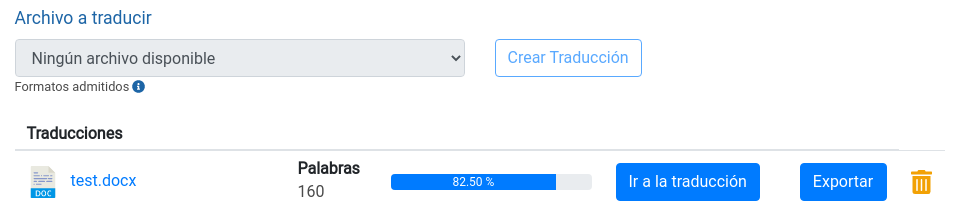

# Trabajo

## Información

### Tipo de trabajo

`No editable`

Tipo de trabajo actual. Según el tipo de trabajo se tiene acceso a distintas funcionalidades de Argos TMS, tal y como se detalla en [Proyecto > Trabajos > Tipo de trabajo](referencia/proyecto.md#tipo-de-trabajo).

### Referencia Int.

`No editable`

Referencia interna del proyecto actual.

### Referencia del Cliente

`No editable`

Número de referencia provisto por el cliente.

### Palabras de Origen

`No editable`

Número de palabras que el manager ha especificado que tiene el documento que va a a ser traducido.

### Fecha límite

`No editable`

Fecha en la que el manager ha especificado que debe cerrarse el trabajo actual.

### Idioma Origen

`No editable`

Idioma en el cual está escrito el documento a traducir.

### Idioma Destino

`No editable`

Idioma en el cual tiene que traducirse el documento suministrado por el cliente.

## Archivos de Entrada

Tabla con los archivos provistos por el manager (`Archivos Originales`) y archivos resultantes de trabajos anteriores.

## Traducción 

Este apartado solo aparecerá cuando el tipo de trabajo actual tenga habilitadas las funciones de traducción automática.

Contiene el listado de traducciones que hay activas dentro del trabajo actual. Tiene la siguiente forma:

Cada traducción tiene los siguientes campos y operaciones:

### Archivo Origen

Archivo a partir del cual se ha creado la traducción

### Palabras

Palabras detectadas en el [Archivo Origen](#archivo-origen)

### Progreso

Porcentaje de segmentos que han sido traducidos.

### Ir a la traducción

Al hacer click en este botón, se cambia la vista al [Traductor](referencia/traductor.md#traductor)

### Exportar

Genera un archivo de salida en el mismo formato que el [Archivo Origen](#archivo-origen) en el apartado [Archivos de Salida](#archivos-de-salida).

Si la traducción no se ha completado, se generará un aviso alertando que el archivo que se va a generar podrá estar incompleto o contener parcial o totalmente el texto de origen.

Si se ha completado la traducción pero no se ha llevado a cabo la [Revisión de estilos](referencia/traductor.md#revisión-de-estilos), se generará una alerta indicando que el formato del texto de destino (negrita, cursiva, etc.) podría no coincidir totalmente con el texto de origen.

## Archivos de Salida

Archivos resultantes del trabajo que se ha encargado. Pueden suministrase vía [Exportar](#exportar) o bien subiendo manualmente el archivo procesado.

## Nota de Entrega

### Volumen Final

Número final de unidades de trabajo que han sido necesarias para completar el trabajo. Por ejemplo, si se trata de una `Traducción convencional`, aquí se especificarían las palabras de destino. Si el tipo de trabajo fuese por ejemplo una `Revisión`, en este campo se especificarían las horas que han sido necesarias.

### Tasa del Proveedor
 
Coste que impone el proveedor por cada unidad de trabajo. Por ejemplo €/Hora o €/Palabra.

### Coste Total

`No editable`

Resultado de multiplicar [Volumen Final](#volumen-final) por [Tasa del Proveedor](#tasa-del-proveedor).

### Notas

`Opcional`

Campo libre a través del cual escribir observaciones al manager sobre el trabajo actual.

## Guardar Borrador

Mediante esta acción se guardarán los cambios que haya habido en el trabajo actual, por ejemplo en los [Archivos de Salida](#archivos-de-salida) o la [Nota de Entrega](#nota-de-entrega).

## Cerrar trabajo

Esta acción indicará al manager que el trabajo actual se ha finalizado por completo y permitirá que se activen los siguientes trabajos que hayan sido especificados en [Proyecto > Trabajos](referencia/proyecto.md#trabajos).
