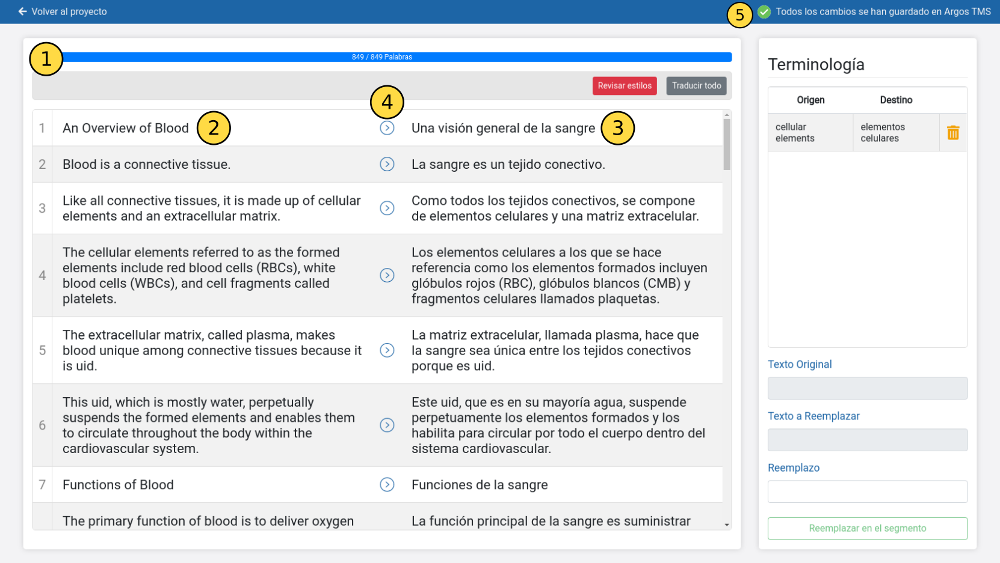
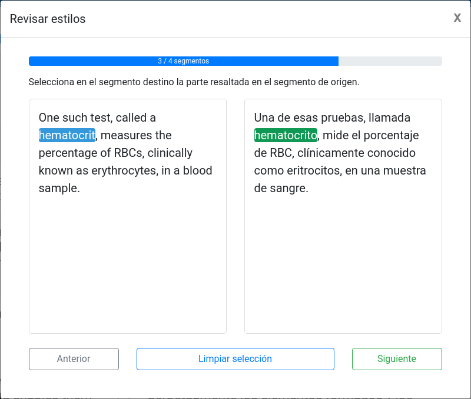

# Traductor

## Partes de la interfaz

1. `Barra de progreso`: Muestra el número de palabras que han sido traducidas y el número total de palabras.
2. `Texto Origen`: Columna donde se muestra el texto del archivo que se está traduciendo separado en segmentos.
3. `Texto Destino`: Columna donde se muestra la traducción del `Texto Origen`.
4. `Copiar Segmento`: Haciendo click en el icono `>`, se copia exactamente el contenido del `Texto Origen` a `Texto Destino`. Esta funcionalidad es útil para evitar cambios introducidos en traducción automática en referencias, nombres o URLs.
5. `Indicador de guardado`: Muestra el estado de la sincronización con el servidor.

## Terminología

Puede ocurrir que un término, al utilizar traducción automática, ha dado un resultado que no es el esperado. Para resolver este problema, en esta sección se pueden introducir los términos mal traducidos manualmente para que sean traducidos correctamente en los siguientes segmentos.

> ### Nuevo término
>
> Para introducir un nuevo término a la traducción actual, deben seguirse los siguientes pasos:
>
> 1. Seleccionar el término en el `Texto Origen`([2](#translator-image)). Éste aparecerá reflejado en el campo [Texto Original](#texto-original).
> 2. Seleccionar el término traducido incorrectamente en el `Texto Destino`([3](#translator-image)). Éste aparecerá reflejado en el campo [Texto a Reemplazar](#texto-a-reemplazar).
> 3. Escribir cómo debería haberse traducido dicho término en el campo [Reemplazo](#reemplazo).
> 4. Pulsar el botón `Reemplazar en el segmento`.

### Texto Original

Texto seleccionado en la columna `Texto Origen`([2](#translator-image)) que será utilizado como `Término origen`.

### Texto a Reemplazar

Texto seleccionado en la columna `Texto Destino`([3](#translator-image)) que será reemplazado en el segmento en curso.

### Reemplazo

Texto que será utilizado como `Término destino` al pulsar `Reemplazar en el segmento`.

## Revisar estilos

Para guardar la máxima consistencia en el formato (negrita, cursiva, etc.) del archivo traducido frente al archivo original, es necesario un mecanismo a través del cual asociar los subsegmentos con formato especial del segmento origen con su correspondiente traducción.

Para asegurar que el archivo guarda su formato original, es necesario pulsar el botón `Revisar estilos` una vez se ha acabado la traducción. Esto hará aparecer el siguiente panel:

En el panel anterior, deben seleccionarse el subsegmento marcado en el texto origen, en el texto destino. Una vez se haya acabado de realizar todas las selecciones, puede procederse a generar el archivo traducido mediante [Trabajo > Traducción > Exportar](referencia/trabajo.md#exportar).

> El proceso de [Revisar estilos](#revisar-estilos) es opcional. En caso de no realizarse, se preservará la mayor parte del formato original pero el resultado no será exacto.

## Traducir todo

Al pulsar el botón, comenzarán a traducirse todos los segmentos en cascada. Este proceso puede pararse haciendo click en el botón que aparecerá en su lugar `Parar traducción`.

**No es recomendable** utilizar esta funcionalidad ya que se pierde la capacidad de utilizar la [Terminología](#terminología) en la traducción y su calidad será menor.
